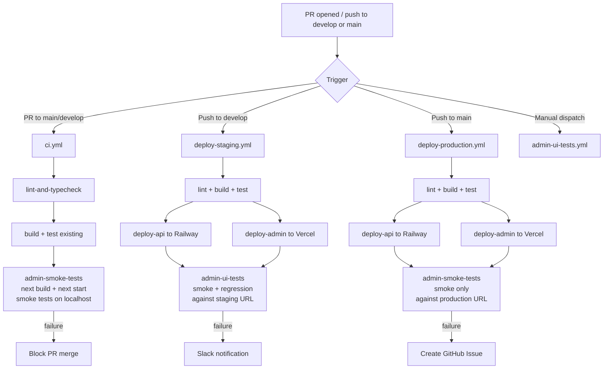

# Admin Portal — UI Testing Strategy

> **Document scope:** Comprehensive smoke and regression UI test plan for the `apps/admin` Next.js 14 portal, with full CI/CD integration across Dev, Staging, and Production environments.

---

## Table of Contents

1. [Overview & Objectives](#1-overview--objectives)
2. [Testing Tool Selection](#2-testing-tool-selection)
3. [Test Architecture & Directory Structure](#3-test-architecture--directory-structure)
4. [Page Object Model (POM) Design](#4-page-object-model-pom-design)
5. [Smoke Test Cases](#5-smoke-test-cases)
6. [Regression Test Cases](#6-regression-test-cases)
7. [Playwright Configuration](#7-playwright-configuration)
8. [CI/CD Integration Design](#8-cicd-integration-design)
9. [Automatic Test Suite Evolution](#9-automatic-test-suite-evolution)
10. [Error Handling & Notifications](#10-error-handling--notifications)
11. [Test Result Tracking & Reporting](#11-test-result-tracking--reporting)
12. [Environment Variable & Secret Requirements](#12-environment-variable--secret-requirements)
13. [Implementation Roadmap](#13-implementation-roadmap)

---

## 1. Overview & Objectives

### Goal

Establish a comprehensive, automated UI testing layer for the **Curex24 Admin Portal** (`apps/admin`) that:

- **Validates every page and user-facing feature** via smoke tests (fast confidence checks) and regression tests (deep functional validation).
- **Runs automatically** at every CI/CD stage — Dev (PR), Staging (post-deploy), and Production (post-deploy).
- **Evolves with the product** — new pages and features automatically require corresponding test coverage, enforced by CI.
- **Provides clear feedback** — test failures trigger notifications and create actionable artifacts (HTML reports, GitHub issues, Slack alerts).

### Scope

| Layer | What it covers |
|---|---|
| **Smoke** | Page loads, critical elements visible, basic navigation, auth flow — runs in < 5 minutes |
| **Regression** | Full functional flows, edge cases, error states, pagination, CRUD actions, cross-cutting concerns |

### Admin Portal Routes

| Route | Feature |
|---|---|
| `/login` | Admin authentication |
| `/dashboard` | Analytics overview, key metrics |
| `/bookings` | Booking management |
| `/providers` | Provider (doctor) management |
| `/verification-queue` | Doctor license verification |
| `/diagnostics` | Diagnostics management |
| `/payouts` | Payout management |
| `/referrals` | Referral program management |
| `/support` | Support ticket management |

---

## 2. Testing Tool Selection

### Recommendation: Playwright

[Playwright](https://playwright.dev/) is the recommended E2E framework for the Curex24 Admin Portal.

#### Justification

| Criterion | Playwright | Why it fits |
|---|---|---|
| **Cross-browser** | Chromium, Firefox, WebKit out of the box | Validates portal across all modern browsers in a single config |
| **Auto-wait** | Waits for elements to be actionable before interacting | Eliminates flaky tests caused by timing/loading states |
| **Next.js support** | Full support for Next.js App Router, including server components and middleware | Admin portal uses Next.js 14 App Router with auth middleware |
| **Built-in reporters** | HTML, JSON, GitHub Actions reporter included | No additional reporter setup required |
| **Auth state reuse** | `storageState` API lets you log in once and reuse session across all tests | Avoids slow repeated login across every test file |
| **Network interception** | `page.route()` for mocking API responses in tests | Enables testing error states and loading states without real API |
| **TypeScript-first** | Full TypeScript support | Consistent with the admin portal's TypeScript codebase |
| **Screenshot/video** | On-failure screenshots and video recording built in | Speeds up debugging CI failures |
| **pnpm compatible** | Installs cleanly via pnpm | No package manager conflicts |

#### Dependencies to Add to `apps/admin/package.json`

Add the following to `devDependencies`:

```json
{
  "devDependencies": {
    "@playwright/test": "^1.44.1",
    "@types/node": "^20.14.2"
  }
}
```

#### Scripts to Add to `apps/admin/package.json`

```json
{
  "scripts": {
    "test:e2e": "playwright test",
    "test:e2e:smoke": "playwright test --grep @smoke",
    "test:e2e:regression": "playwright test --grep @regression",
    "test:e2e:ui": "playwright test --ui",
    "test:e2e:report": "playwright show-report",
    "test:e2e:codegen": "playwright codegen"
  }
}
```

#### Install Command

```bash
# From the monorepo root — install Playwright test package
pnpm install

# Install browser binaries
pnpm --filter @curex24/admin exec playwright install --with-deps
```

---

## 3. Test Architecture & Directory Structure

All E2E tests live under `apps/admin/e2e/` to keep them separate from the Next.js application source. The directory follows a **Page Object Model (POM)** pattern with dedicated folders for smoke, regression, fixtures, helpers, and test data.

### Full Directory Tree

```
apps/admin/
├── e2e/
│   ├── smoke/                          # Fast smoke test suites (tagged @smoke)
│   │   ├── auth.smoke.spec.ts          # Login / logout / auth guard
│   │   ├── dashboard.smoke.spec.ts     # Dashboard page loads
│   │   ├── bookings.smoke.spec.ts      # Bookings page loads
│   │   ├── providers.smoke.spec.ts     # Providers page loads
│   │   ├── verification-queue.smoke.spec.ts
│   │   ├── diagnostics.smoke.spec.ts
│   │   ├── payouts.smoke.spec.ts
│   │   ├── referrals.smoke.spec.ts
│   │   ├── support.smoke.spec.ts
│   │   └── navigation.smoke.spec.ts    # Sidebar navigation between pages
│   │
│   ├── regression/                     # Deep functional regression suites (tagged @regression)
│   │   ├── auth.regression.spec.ts
│   │   ├── dashboard.regression.spec.ts
│   │   ├── bookings.regression.spec.ts
│   │   ├── providers.regression.spec.ts
│   │   ├── verification-queue.regression.spec.ts
│   │   ├── diagnostics.regression.spec.ts
│   │   ├── payouts.regression.spec.ts
│   │   ├── referrals.regression.spec.ts
│   │   ├── support.regression.spec.ts
│   │   └── cross-cutting.regression.spec.ts  # Auth guards, error states, responsive
│   │
│   ├── pages/                          # Page Object Model classes
│   │   ├── LoginPage.ts
│   │   ├── DashboardPage.ts
│   │   ├── BookingsPage.ts
│   │   ├── ProvidersPage.ts
│   │   ├── VerificationQueuePage.ts
│   │   ├── DiagnosticsPage.ts
│   │   ├── PayoutsPage.ts
│   │   ├── ReferralsPage.ts
│   │   ├── SupportPage.ts
│   │   └── components/
│   │       ├── SidebarComponent.ts
│   │       └── HeaderComponent.ts
│   │
│   ├── fixtures/
│   │   ├── auth.fixture.ts             # Authenticated page fixture (reuses storageState)
│   │   └── index.ts                    # Re-exports all fixtures
│   │
│   ├── helpers/
│   │   ├── api-mock.helper.ts          # Utilities for mocking API responses
│   │   ├── auth.helper.ts              # Login/logout helpers
│   │   └── wait.helper.ts              # Custom wait utilities
│   │
│   ├── test-data/
│   │   ├── users.json                  # Test user credentials
│   │   ├── bookings.json               # Mock booking data
│   │   ├── providers.json              # Mock provider data
│   │   └── index.ts                    # Exports typed test data
│   │
│   ├── global-setup.ts                 # Runs once before all tests: performs login, saves auth state
│   ├── global-teardown.ts              # Cleanup after all tests
│   └── test-manifest.json              # Route → test file mapping (for coverage validation)
│
├── playwright.config.ts                # Playwright configuration
└── package.json                        # (updated with @playwright/test + test scripts)
```

### Key Design Principles

1. **Single source of truth for selectors** — all CSS selectors and locators live in POM classes, never duplicated across test files.
2. **One auth login** — `global-setup.ts` logs in once and saves `storageState` to `.auth/admin.json`; all tests reuse this state.
3. **Tag-based filtering** — every smoke test is tagged `@smoke`, every regression test is tagged `@regression` so CI can run subsets independently.
4. **API mocking for regression** — regression tests mock the API using `page.route()` to run fast and deterministically without live data.
5. **Smoke tests hit real URLs** — smoke tests run against a real (deployed or local) app without mocking to confirm end-to-end connectivity.

---

## 4. Page Object Model (POM) Design

Each admin page has a corresponding POM class that encapsulates:

- **Locators** — `readonly` `Locator` fields for all interactive elements and key UI regions.
- **Actions** — methods for user interactions (e.g., `login()`, `clickBooking()`).
- **Assertions** — methods that assert the page is in the expected state.

### POM Class Inventory

| POM Class | File | Covers |
|---|---|---|
| `LoginPage` | `pages/LoginPage.ts` | Login form, error message, submit button |
| `DashboardPage` | `pages/DashboardPage.ts` | Metric cards, charts, date filter |
| `BookingsPage` | `pages/BookingsPage.ts` | Bookings table, search, filter, pagination, detail view |
| `ProvidersPage` | `pages/ProvidersPage.ts` | Providers table, search, filter, approve/reject, detail |
| `VerificationQueuePage` | `pages/VerificationQueuePage.ts` | Queue table, document viewer, approve/reject, status filter |
| `DiagnosticsPage` | `pages/DiagnosticsPage.ts` | Diagnostics table, search, filter, detail view |
| `PayoutsPage` | `pages/PayoutsPage.ts` | Payouts table, status/date filter, initiate payout |
| `ReferralsPage` | `pages/ReferralsPage.ts` | Referrals table, search, stats section, detail |
| `SupportPage` | `pages/SupportPage.ts` | Ticket list, search/filter, detail, reply, status update |
| `SidebarComponent` | `pages/components/SidebarComponent.ts` | Nav links, active state, brand logo |
| `HeaderComponent` | `pages/components/HeaderComponent.ts` | Page title, user info, logout button |

### TypeScript Example: `LoginPage`

```typescript
// apps/admin/e2e/pages/LoginPage.ts
import { type Locator, type Page } from '@playwright/test';

export class LoginPage {
  readonly page: Page;

  // Form elements
  readonly emailInput: Locator;
  readonly passwordInput: Locator;
  readonly submitButton: Locator;

  // Feedback elements
  readonly errorMessage: Locator;
  readonly loadingSpinner: Locator;

  // Page heading
  readonly heading: Locator;

  constructor(page: Page) {
    this.page = page;
    this.emailInput    = page.getByLabel('Email');
    this.passwordInput = page.getByLabel('Password');
    this.submitButton  = page.getByRole('button', { name: /sign in/i });
    this.errorMessage  = page.getByRole('alert');
    this.loadingSpinner = page.getByTestId('loading-spinner');
    this.heading       = page.getByRole('heading', { name: /curex24 admin/i });
  }

  async goto(): Promise<void> {
    await this.page.goto('/login');
  }

  async login(email: string, password: string): Promise<void> {
    await this.emailInput.fill(email);
    await this.passwordInput.fill(password);
    await this.submitButton.click();
  }

  async waitForRedirectToDashboard(): Promise<void> {
    await this.page.waitForURL('**/dashboard', { timeout: 10_000 });
  }

  async assertErrorVisible(message?: string): Promise<void> {
    await this.errorMessage.waitFor({ state: 'visible' });
    if (message) {
      await this.page.getByText(message).waitFor({ state: 'visible' });
    }
  }

  async assertLoginFormVisible(): Promise<void> {
    await this.emailInput.waitFor({ state: 'visible' });
    await this.passwordInput.waitFor({ state: 'visible' });
    await this.submitButton.waitFor({ state: 'visible' });
  }
}
```

### TypeScript Example: `DashboardPage`

```typescript
// apps/admin/e2e/pages/DashboardPage.ts
import { type Locator, type Page } from '@playwright/test';
import { SidebarComponent } from './components/SidebarComponent';
import { HeaderComponent } from './components/HeaderComponent';

export class DashboardPage {
  readonly page: Page;
  readonly sidebar: SidebarComponent;
  readonly header: HeaderComponent;

  // Metric cards (adapt selectors to actual DOM)
  readonly totalBookingsCard: Locator;
  readonly totalProvidersCard: Locator;
  readonly totalRevenueCard: Locator;
  readonly pendingVerificationsCard: Locator;

  // Charts / data regions
  readonly bookingsTrendChart: Locator;
  readonly revenueChart: Locator;

  // Date filter
  readonly dateRangeFilter: Locator;

  // Loading indicator
  readonly loadingState: Locator;

  constructor(page: Page) {
    this.page = page;
    this.sidebar = new SidebarComponent(page);
    this.header  = new HeaderComponent(page);

    this.totalBookingsCard       = page.getByTestId('metric-card-bookings');
    this.totalProvidersCard      = page.getByTestId('metric-card-providers');
    this.totalRevenueCard        = page.getByTestId('metric-card-revenue');
    this.pendingVerificationsCard = page.getByTestId('metric-card-pending-verifications');

    this.bookingsTrendChart = page.getByTestId('chart-bookings-trend');
    this.revenueChart       = page.getByTestId('chart-revenue');

    this.dateRangeFilter = page.getByRole('combobox', { name: /date range/i });
    this.loadingState    = page.getByTestId('dashboard-loading');
  }

  async goto(): Promise<void> {
    await this.page.goto('/dashboard');
  }

  async waitForLoad(): Promise<void> {
    // Wait until the loading indicator is gone and at least one metric card is visible
    await this.loadingState.waitFor({ state: 'hidden', timeout: 15_000 }).catch(() => {});
    await this.totalBookingsCard.waitFor({ state: 'visible', timeout: 15_000 });
  }

  async selectDateRange(range: '7d' | '30d' | '90d' | 'custom'): Promise<void> {
    await this.dateRangeFilter.selectOption(range);
    await this.waitForLoad();
  }

  async getMetricValue(card: Locator): Promise<string> {
    return (await card.getByTestId('metric-value').textContent()) ?? '';
  }

  async assertAllMetricCardsVisible(): Promise<void> {
    await this.totalBookingsCard.waitFor({ state: 'visible' });
    await this.totalProvidersCard.waitFor({ state: 'visible' });
    await this.totalRevenueCard.waitFor({ state: 'visible' });
    await this.pendingVerificationsCard.waitFor({ state: 'visible' });
  }
}
```

### TypeScript Example: `SidebarComponent`

```typescript
// apps/admin/e2e/pages/components/SidebarComponent.ts
import { type Locator, type Page } from '@playwright/test';

export class SidebarComponent {
  readonly page: Page;
  readonly nav: Locator;
  readonly brandLogo: Locator;

  // Nav links
  readonly dashboardLink: Locator;
  readonly bookingsLink: Locator;
  readonly providersLink: Locator;
  readonly verificationQueueLink: Locator;
  readonly diagnosticsLink: Locator;
  readonly payoutsLink: Locator;
  readonly referralsLink: Locator;
  readonly supportLink: Locator;

  constructor(page: Page) {
    this.page = page;
    this.nav       = page.getByRole('navigation');
    this.brandLogo = page.getByText('Curex24').first();

    this.dashboardLink          = page.getByRole('link', { name: /dashboard/i });
    this.bookingsLink           = page.getByRole('link', { name: /bookings/i });
    this.providersLink          = page.getByRole('link', { name: /providers/i });
    this.verificationQueueLink  = page.getByRole('link', { name: /verification queue/i });
    this.diagnosticsLink        = page.getByRole('link', { name: /diagnostics/i });
    this.payoutsLink            = page.getByRole('link', { name: /payouts/i });
    this.referralsLink          = page.getByRole('link', { name: /referrals/i });
    this.supportLink            = page.getByRole('link', { name: /support/i });
  }

  async navigateTo(page: 'dashboard' | 'bookings' | 'providers' | 'verification-queue' | 'diagnostics' | 'payouts' | 'referrals' | 'support'): Promise<void> {
    const linkMap: Record<string, Locator> = {
      'dashboard':          this.dashboardLink,
      'bookings':           this.bookingsLink,
      'providers':          this.providersLink,
      'verification-queue': this.verificationQueueLink,
      'diagnostics':        this.diagnosticsLink,
      'payouts':            this.payoutsLink,
      'referrals':          this.referralsLink,
      'support':            this.supportLink,
    };
    await linkMap[page].click();
    await this.page.waitForURL(`**/${page}`, { timeout: 10_000 });
  }

  async assertActivePage(page: string): Promise<void> {
    const activeLink = this.page.getByRole('link', { name: new RegExp(page, 'i') });
    await activeLink.waitFor({ state: 'visible' });
    // Active links have the 'bg-primary' Tailwind class in Sidebar.tsx
    const classList = await activeLink.getAttribute('class') ?? '';
    if (!classList.includes('bg-primary')) {
      throw new Error(`Expected "${page}" link to have active (bg-primary) class, got: ${classList}`);
    }
  }
}
```

---

## 5. Smoke Test Cases

Smoke tests verify that every page loads correctly, critical UI elements are visible, and basic flows work. They run in < 5 minutes and are tagged `@smoke`.

> **Precondition (unless noted):** Admin is authenticated. Tests reuse the `storageState` set up by `global-setup.ts`.

### 5.1 Authentication Smoke Tests

| Test ID | Page | Test Name | Steps | Expected Result |
|---|---|---|---|---|
| SM-AUTH-01 | `/login` | Login page renders | 1. Navigate to `/login` (unauthenticated) | Email field, password field, and "Sign In" button are visible |
| SM-AUTH-02 | `/login` | Invalid credentials show error | 1. Enter invalid email/password 2. Click Sign In | Error alert appears with an error message; user remains on `/login` |
| SM-AUTH-03 | `/login` | Successful login redirects to dashboard | 1. Enter valid admin credentials 2. Click Sign In | User is redirected to `/dashboard`; sidebar is visible |
| SM-AUTH-04 | `/login` | Already-authenticated user is redirected | 1. Authenticated user navigates to `/login` | Middleware redirects to `/dashboard` |
| SM-AUTH-05 | Any protected page | Unauthenticated access redirects to login | 1. Clear cookies 2. Navigate to `/dashboard` | Redirected to `/login` |
| SM-AUTH-06 | `/dashboard` | Logout functionality | 1. Click logout button in header | User is redirected to `/login`; `admin_token` cookie is cleared |

### 5.2 Dashboard Smoke Tests

| Test ID | Page | Test Name | Steps | Expected Result |
|---|---|---|---|---|
| SM-DASH-01 | `/dashboard` | Dashboard page loads | 1. Navigate to `/dashboard` | Page title contains "Dashboard"; at least one metric card is visible |
| SM-DASH-02 | `/dashboard` | Key metric cards visible | 1. Navigate to `/dashboard` 2. Wait for load | Total Bookings, Total Providers, and Pending Verifications cards are all visible |
| SM-DASH-03 | `/dashboard` | Sidebar is visible | 1. Navigate to `/dashboard` | Sidebar navigation with all 8 links is visible |

### 5.3 Bookings Smoke Tests

| Test ID | Page | Test Name | Steps | Expected Result |
|---|---|---|---|---|
| SM-BOOK-01 | `/bookings` | Bookings page loads | 1. Navigate to `/bookings` | Page title contains "Bookings" |
| SM-BOOK-02 | `/bookings` | Primary table/list is displayed | 1. Navigate to `/bookings` 2. Wait for load | A table or list of bookings (or empty state) is visible |
| SM-BOOK-03 | `/bookings` | Search input is present | 1. Navigate to `/bookings` | Search/filter input element is present on the page |

### 5.4 Providers Smoke Tests

| Test ID | Page | Test Name | Steps | Expected Result |
|---|---|---|---|---|
| SM-PROV-01 | `/providers` | Providers page loads | 1. Navigate to `/providers` | Page title contains "Providers" |
| SM-PROV-02 | `/providers` | Providers list/table is displayed | 1. Navigate to `/providers` 2. Wait for load | A table or list (or empty state) is visible |
| SM-PROV-03 | `/providers` | Search input is present | 1. Navigate to `/providers` | Search input is visible |

### 5.5 Verification Queue Smoke Tests

| Test ID | Page | Test Name | Steps | Expected Result |
|---|---|---|---|---|
| SM-VQ-01 | `/verification-queue` | Verification Queue page loads | 1. Navigate to `/verification-queue` | Page title contains "Verification" |
| SM-VQ-02 | `/verification-queue` | Queue table/list is displayed | 1. Navigate to `/verification-queue` 2. Wait for load | Queue items (or empty state) are visible |
| SM-VQ-03 | `/verification-queue` | Status filter is present | 1. Navigate to `/verification-queue` | A filter control (dropdown/tabs) for status is visible |

### 5.6 Diagnostics Smoke Tests

| Test ID | Page | Test Name | Steps | Expected Result |
|---|---|---|---|---|
| SM-DIAG-01 | `/diagnostics` | Diagnostics page loads | 1. Navigate to `/diagnostics` | Page title contains "Diagnostics" |
| SM-DIAG-02 | `/diagnostics` | Diagnostics list is displayed | 1. Navigate to `/diagnostics` 2. Wait for load | A table or list (or empty state) is visible |

### 5.7 Payouts Smoke Tests

| Test ID | Page | Test Name | Steps | Expected Result |
|---|---|---|---|---|
| SM-PAY-01 | `/payouts` | Payouts page loads | 1. Navigate to `/payouts` | Page title contains "Payouts" |
| SM-PAY-02 | `/payouts` | Payouts table is displayed | 1. Navigate to `/payouts` 2. Wait for load | A table or list (or empty state) is visible |
| SM-PAY-03 | `/payouts` | Status filter is present | 1. Navigate to `/payouts` | Filter control for payout status is visible |

### 5.8 Referrals Smoke Tests

| Test ID | Page | Test Name | Steps | Expected Result |
|---|---|---|---|---|
| SM-REF-01 | `/referrals` | Referrals page loads | 1. Navigate to `/referrals` | Page title contains "Referrals" |
| SM-REF-02 | `/referrals` | Referrals list is displayed | 1. Navigate to `/referrals` 2. Wait for load | A table or list (or empty state) is visible |
| SM-REF-03 | `/referrals` | Stats section is visible | 1. Navigate to `/referrals` | Referral statistics/summary section is present |

### 5.9 Support Smoke Tests

| Test ID | Page | Test Name | Steps | Expected Result |
|---|---|---|---|---|
| SM-SUP-01 | `/support` | Support page loads | 1. Navigate to `/support` | Page title contains "Support" |
| SM-SUP-02 | `/support` | Ticket list is displayed | 1. Navigate to `/support` 2. Wait for load | A list of support tickets (or empty state) is visible |
| SM-SUP-03 | `/support` | Search/filter is present | 1. Navigate to `/support` | Search input or status filter is present |

### 5.10 Sidebar Navigation Smoke Tests

| Test ID | Page | Test Name | Steps | Expected Result |
|---|---|---|---|---|
| SM-NAV-01 | Global | Sidebar displays all nav links | 1. Navigate to `/dashboard` | All 8 nav links (Dashboard, Verification Queue, Providers, Bookings, Payouts, Diagnostics, Referrals, Support) are visible |
| SM-NAV-02 | Global | Navigate to Bookings via sidebar | 1. Click "Bookings" in sidebar | URL changes to `/bookings`; Bookings link has active styling |
| SM-NAV-03 | Global | Navigate to Providers via sidebar | 1. Click "Providers" in sidebar | URL changes to `/providers`; Providers link has active styling |
| SM-NAV-04 | Global | Navigate to Verification Queue via sidebar | 1. Click "Verification Queue" in sidebar | URL changes to `/verification-queue` |
| SM-NAV-05 | Global | Navigate to Payouts via sidebar | 1. Click "Payouts" in sidebar | URL changes to `/payouts` |
| SM-NAV-06 | Global | Navigate to Support via sidebar | 1. Click "Support" in sidebar | URL changes to `/support` |
| SM-NAV-07 | Global | Brand logo link navigates to dashboard | 1. Click "Curex24" brand in sidebar from any page | URL changes to `/dashboard` |

---

## 6. Regression Test Cases

Regression tests provide deep functional coverage. They use API mocking (`page.route()`) for deterministic, fast execution and are tagged `@regression`.

### 6.1 Authentication Regression Tests

| Test ID | Test Name | Steps | Expected Result |
|---|---|---|---|
| RG-AUTH-01 | Valid admin credentials log in successfully | Fill valid email + password → Submit | Redirect to `/dashboard`; `admin_token` cookie set |
| RG-AUTH-02 | Invalid email format shows validation error | Enter `notanemail` in email field → Submit | Form validation error on email field before API call |
| RG-AUTH-03 | Wrong password shows API error message | Enter valid email + wrong password → Submit | Error alert with "Invalid credentials" or similar message |
| RG-AUTH-04 | Empty form submit shows validation errors | Click Submit with empty fields | Both fields show required validation messages |
| RG-AUTH-05 | Session persists on page reload | Log in → Reload page | Still on `/dashboard`; no redirect to login |
| RG-AUTH-06 | Session persists on browser back navigation | Log in → Navigate to bookings → Click back | Remains authenticated; not redirected to login |
| RG-AUTH-07 | Expired token redirects to login | Set expired JWT in `admin_token` cookie → Navigate to `/dashboard` | Middleware redirects to `/login` |
| RG-AUTH-08 | Malformed token redirects to login | Set random string as `admin_token` → Navigate to `/dashboard` | Middleware redirects to `/login` |
| RG-AUTH-09 | Redirect after login preserves intended page | Navigate to `/bookings` unauthenticated → Login | After login, lands on `/bookings` (if supported) or `/dashboard` |
| RG-AUTH-10 | Logout clears session and redirects | Click logout → Navigate back via browser history | Cannot access protected pages; redirected to `/login` |
| RG-AUTH-11 | Login button shows loading state during API call | Submit login form | Button shows loading state while API call is in progress |
| RG-AUTH-12 | Network error during login shows error | Mock API to return 500 → Submit login form | Error message visible; form remains operable |

### 6.2 Dashboard Regression Tests

| Test ID | Test Name | Steps | Expected Result |
|---|---|---|---|
| RG-DASH-01 | Dashboard loads all metric cards with data | Navigate to `/dashboard` → Wait for load | All metric cards visible with numeric values (not `—` or loading) |
| RG-DASH-02 | Metric card values are numeric | Navigate to `/dashboard` → Read metric card values | All values are parseable numbers or formatted currency |
| RG-DASH-03 | Bookings trend chart renders | Navigate to `/dashboard` | Chart element is present in the DOM and has non-zero dimensions |
| RG-DASH-04 | Date range filter — 7 days | Select "7 days" from date filter → Wait for reload | Metric values update; chart re-renders with 7-day data |
| RG-DASH-05 | Date range filter — 30 days | Select "30 days" → Wait for reload | Metric values update |
| RG-DASH-06 | Date range filter — 90 days | Select "90 days" → Wait for reload | Metric values update |
| RG-DASH-07 | Loading state shown before data arrives | Mock API with a 2s delay → Navigate to dashboard | Loading spinner or skeleton visible during fetch |
| RG-DASH-08 | API error state renders gracefully | Mock API to return 500 → Navigate to dashboard | Error message shown; page does not crash |
| RG-DASH-09 | Empty data state (zero metrics) renders gracefully | Mock API returning all zeros → Navigate to dashboard | Cards show "0" not blank/undefined |
| RG-DASH-10 | Dashboard accessible from all other pages | Navigate from each sub-page back to Dashboard via sidebar | Dashboard loads correctly each time |

### 6.3 Bookings Regression Tests

| Test ID | Test Name | Steps | Expected Result |
|---|---|---|---|
| RG-BOOK-01 | Bookings list renders correctly | Navigate to `/bookings` → Wait for load | Table with columns (ID, Patient, Provider, Date, Status) visible |
| RG-BOOK-02 | Pagination controls visible when > page size | Mock API returning more than one page of bookings | Next/Previous pagination controls are visible |
| RG-BOOK-03 | Next page navigation works | Click "Next page" → Wait for load | URL or state updates; new set of bookings displayed |
| RG-BOOK-04 | Previous page navigation works | Go to page 2 → Click "Previous" | Returns to page 1 |
| RG-BOOK-05 | Search by patient name filters results | Type a patient name in the search box → Wait | Only rows matching the search term are displayed |
| RG-BOOK-06 | Search with no results shows empty state | Type gibberish in search → Wait | Empty state message visible; no table rows |
| RG-BOOK-07 | Filter by booking status — Confirmed | Select "Confirmed" from status filter | Only confirmed bookings shown |
| RG-BOOK-08 | Filter by booking status — Cancelled | Select "Cancelled" from status filter | Only cancelled bookings shown |
| RG-BOOK-09 | Clear filters restores full list | Apply a filter → Click "Clear" / reset | Full booking list restored |
| RG-BOOK-10 | Clicking a booking row opens detail view | Click on a booking row | Booking detail panel or page renders with booking info |
| RG-BOOK-11 | Booking detail shows all relevant fields | Open a booking detail | Patient name, provider, date, status, and amount are visible |
| RG-BOOK-12 | Status badge colour matches status | View a "Confirmed" booking vs a "Cancelled" one | Status badges have correct colour coding |
| RG-BOOK-13 | API error shows error state | Mock API to return 500 → Navigate to `/bookings` | Error message shown; not a blank page |
| RG-BOOK-14 | Loading skeleton shown before data | Mock API with delay → Navigate to `/bookings` | Skeleton loader visible before data arrives |

### 6.4 Providers Regression Tests

| Test ID | Test Name | Steps | Expected Result |
|---|---|---|---|
| RG-PROV-01 | Providers list renders with all columns | Navigate to `/providers` → Wait for load | Table with name, specialisation, status, joined date visible |
| RG-PROV-02 | Search by provider name | Type a name in search | Only matching providers shown |
| RG-PROV-03 | Search with no results shows empty state | Type gibberish | Empty state message visible |
| RG-PROV-04 | Filter by status — Active | Select "Active" filter | Only active providers shown |
| RG-PROV-05 | Filter by status — Pending | Select "Pending" filter | Only pending providers shown |
| RG-PROV-06 | Clicking a provider opens detail view | Click a provider row | Provider detail view renders |
| RG-PROV-07 | Provider detail shows full profile | Open a provider detail | Name, specialisation, qualifications, verification status, contact visible |
| RG-PROV-08 | Approve provider action | Open a pending provider → Click "Approve" | Confirmation dialog appears → Confirm → Status updates to "Approved" |
| RG-PROV-09 | Reject provider action | Open a pending provider → Click "Reject" → Enter reason | Status updates to "Rejected"; reason recorded |
| RG-PROV-10 | Pagination works | Mock API returning multiple pages | Pagination controls work correctly |
| RG-PROV-11 | API error on approve shows notification | Mock approve endpoint to return 500 → Click Approve | Error notification shown; status not changed |

### 6.5 Verification Queue Regression Tests

| Test ID | Test Name | Steps | Expected Result |
|---|---|---|---|
| RG-VQ-01 | Queue renders all pending verifications | Navigate to `/verification-queue` | List of pending doctor verifications visible |
| RG-VQ-02 | Filter by status — Pending | Select "Pending" filter | Only pending items shown |
| RG-VQ-03 | Filter by status — Approved | Select "Approved" filter | Only approved items shown |
| RG-VQ-04 | Filter by status — Rejected | Select "Rejected" filter | Only rejected items shown |
| RG-VQ-05 | Clicking an item opens document viewer | Click a verification item | Document viewer panel opens with submitted documents |
| RG-VQ-06 | Document images/files are viewable | Open a verification item | NMC certificate or document preview is visible |
| RG-VQ-07 | Approve verification action | Select a pending item → Click "Approve" → Confirm | Status changes to "Approved"; item moves to approved list |
| RG-VQ-08 | Reject verification with reason | Select a pending item → Click "Reject" → Enter reason → Confirm | Status changes to "Rejected"; rejection reason shown |
| RG-VQ-09 | Empty queue state renders correctly | Mock API returning empty array | "No pending verifications" or similar message shown |
| RG-VQ-10 | Retry NMC verification | Select an item → Click "Retry NMC Check" | New NMC API check is triggered; result updated |

### 6.6 Diagnostics Regression Tests

| Test ID | Test Name | Steps | Expected Result |
|---|---|---|---|
| RG-DIAG-01 | Diagnostics list renders with all columns | Navigate to `/diagnostics` → Wait | Table with diagnostic name, type, status visible |
| RG-DIAG-02 | Search by diagnostic name | Type in search box | Filtered results shown |
| RG-DIAG-03 | Filter by diagnostic type/category | Select a category filter | Only matching diagnostics shown |
| RG-DIAG-04 | Clicking a diagnostic opens detail | Click a row | Detail view opens with full diagnostic information |
| RG-DIAG-05 | Detail view shows all fields | Open a diagnostic detail | Name, description, price, availability, provider visible |
| RG-DIAG-06 | Update diagnostic status | In detail view, change status → Save | Status updates correctly; success notification shown |
| RG-DIAG-07 | Pagination works | Mock multiple pages | Pagination controls work |
| RG-DIAG-08 | Empty state renders | Mock empty API response | Empty state message shown |
| RG-DIAG-09 | API error shows error notification | Mock 500 error | Friendly error message shown; page does not crash |

### 6.7 Payouts Regression Tests

| Test ID | Test Name | Steps | Expected Result |
|---|---|---|---|
| RG-PAY-01 | Payouts list renders with all columns | Navigate to `/payouts` → Wait | Table with provider, amount, status, date visible |
| RG-PAY-02 | Filter by payout status — Pending | Select "Pending" | Only pending payouts shown |
| RG-PAY-03 | Filter by payout status — Processed | Select "Processed" | Only processed payouts shown |
| RG-PAY-04 | Filter by payout status — Failed | Select "Failed" | Only failed payouts shown |
| RG-PAY-05 | Filter by date range | Select a date range | Only payouts in that range shown |
| RG-PAY-06 | Combine status + date filters | Select status + date range | Results satisfy both filters |
| RG-PAY-07 | Click payout row opens detail | Click a payout row | Detail panel/view shows payout info |
| RG-PAY-08 | Payout detail shows breakdown | Open a payout detail | Provider name, amount, fee, net amount, bank details visible |
| RG-PAY-09 | Initiate payout for pending provider | Select a pending payout → Click "Initiate Payout" → Confirm | Payout status changes to "Processing"; success notification |
| RG-PAY-10 | Failed payout shows reason | Filter to failed payouts → Open detail | Failure reason/error message displayed |
| RG-PAY-11 | Pagination works for large payout lists | Mock multiple pages | Pagination controls functional |
| RG-PAY-12 | Export payouts (if supported) | Click "Export" button | CSV file downloaded with payout data |

### 6.8 Referrals Regression Tests

| Test ID | Test Name | Steps | Expected Result |
|---|---|---|---|
| RG-REF-01 | Referrals list renders with all columns | Navigate to `/referrals` → Wait | Table with referrer, referred user, status, reward visible |
| RG-REF-02 | Search by referrer name | Type in search | Matching referrals shown |
| RG-REF-03 | Search by referral code | Type a code in search | Matching referral shown |
| RG-REF-04 | Referral stats/summary section shows data | Navigate to `/referrals` | Stats cards (total referrals, successful, pending) visible with values |
| RG-REF-05 | Click referral row opens detail | Click a row | Detail view with referrer, referred user, timestamps, reward status visible |
| RG-REF-06 | Filter by status — Active | Select "Active" | Only active referrals shown |
| RG-REF-07 | Filter by status — Completed | Select "Completed" | Only completed referrals shown |
| RG-REF-08 | Empty state renders | Mock empty API response | Empty state message shown |
| RG-REF-09 | Pagination works | Mock multiple pages | Pagination controls functional |

### 6.9 Support Regression Tests

| Test ID | Test Name | Steps | Expected Result |
|---|---|---|---|
| RG-SUP-01 | Ticket list renders with all columns | Navigate to `/support` → Wait | Table with ticket ID, subject, user, status, created date visible |
| RG-SUP-02 | Search by ticket subject | Type in search | Matching tickets shown |
| RG-SUP-03 | Search by user name/email | Type a user name | Matching tickets shown |
| RG-SUP-04 | Filter by status — Open | Select "Open" | Only open tickets shown |
| RG-SUP-05 | Filter by status — In Progress | Select "In Progress" | Only in-progress tickets shown |
| RG-SUP-06 | Filter by status — Resolved | Select "Resolved" | Only resolved tickets shown |
| RG-SUP-07 | Filter by status — Closed | Select "Closed" | Only closed tickets shown |
| RG-SUP-08 | Click ticket row opens detail | Click a ticket row | Ticket detail view with message thread visible |
| RG-SUP-09 | Ticket detail shows full message history | Open a ticket with replies | All messages in chronological order visible |
| RG-SUP-10 | Reply to ticket | Open a ticket → Type a response → Click "Send" | Reply posted; appears in message thread |
| RG-SUP-11 | Reply input validation | Click "Send" with empty reply | Validation error; message not sent |
| RG-SUP-12 | Update ticket status to Resolved | In ticket detail → Change status → Save | Status updates to "Resolved"; confirmation shown |
| RG-SUP-13 | Update ticket status to Closed | Change status to "Closed" | Status updates; ticket moved to closed filter |
| RG-SUP-14 | Pagination for ticket list | Mock multiple pages | Pagination controls functional |
| RG-SUP-15 | Empty state for no tickets | Mock empty API | Empty state message shown |

### 6.10 Cross-Cutting Regression Tests

| Test ID | Test Name | Steps | Expected Result |
|---|---|---|---|
| RG-CC-01 | Auth guard — unauthenticated access to `/dashboard` | Clear cookies → Navigate to `/dashboard` | Redirect to `/login` |
| RG-CC-02 | Auth guard — unauthenticated access to `/bookings` | Clear cookies → Navigate to `/bookings` | Redirect to `/login` |
| RG-CC-03 | Auth guard — all protected routes redirect | Clear cookies → Navigate to each dashboard route | All redirect to `/login` |
| RG-CC-04 | Static assets bypass middleware | Navigate to `/_next/static/...` path | Accessible without authentication |
| RG-CC-05 | Global error boundary — API completely down | Mock all API calls to fail with network error → Navigate to any page | Error boundary or friendly error UI shown; no unhandled crash |
| RG-CC-06 | Loading states — slow API | Mock all API calls with 3s delay | Loading skeletons / spinners visible during fetch on every page |
| RG-CC-07 | Responsive layout — tablet (768px) | Set viewport to 768×1024 → Navigate through pages | Layout reflows correctly; sidebar may collapse |
| RG-CC-08 | Responsive layout — desktop (1280px) | Set viewport to 1280×800 → Navigate through pages | Full desktop layout with sidebar always visible |
| RG-CC-09 | Responsive layout — wide screen (1920px) | Set viewport to 1920×1080 | No horizontal overflow; content centred/constrained |
| RG-CC-10 | Browser back button works correctly | Navigate: Dashboard → Bookings → click Back | Returns to Dashboard; page renders correctly |
| RG-CC-11 | Direct URL navigation (deep link) | Type `/providers` directly in browser URL | Authenticated user reaches Providers page directly |
| RG-CC-12 | Session timeout during active session | Invalidate token server-side → Navigate | Redirected to `/login` with appropriate message |
| RG-CC-13 | 404 page for unknown route | Navigate to `/nonexistent-route` | 404 error page shown; sidebar may still be visible |
| RG-CC-14 | Keyboard navigation | Tab through interactive elements on any page | All interactive elements reachable via keyboard; focus order is logical |

---

## 7. Playwright Configuration

Create `apps/admin/playwright.config.ts` with the following content:

```typescript
// apps/admin/playwright.config.ts
import { defineConfig, devices } from '@playwright/test';

/**
 * Resolve base URL from environment variables.
 * - Dev CI:    ADMIN_BASE_URL is not set → falls back to http://localhost:3001
 * - Staging:   ADMIN_BASE_URL=https://admin.staging.curex24.com
 * - Production: ADMIN_BASE_URL=https://admin.curex24.com
 */
const baseURL = process.env.ADMIN_BASE_URL ?? 'http://localhost:3001';

export default defineConfig({
  testDir: './e2e',

  /* Maximum time one test can run */
  timeout: 30_000,

  /* Maximum time for expect() assertions */
  expect: {
    timeout: 10_000,
  },

  /* Run tests in files in parallel */
  fullyParallel: true,

  /* Fail the build on CI if test.only is left in source */
  forbidOnly: !!process.env.CI,

  /* Retry on CI only — 1 retry to avoid flaky failures */
  retries: process.env.CI ? 1 : 0,

  /* Limit parallelism on CI to avoid resource exhaustion */
  workers: process.env.CI ? 2 : undefined,

  /* Global test setup (login once, save auth state) */
  globalSetup: './e2e/global-setup.ts',
  globalTeardown: './e2e/global-teardown.ts',

  /* Reporter configuration */
  reporter: [
    ['list'],                                    // Console output for developer feedback
    ['html', { outputFolder: 'playwright-report', open: 'never' }],
    ['json', { outputFile: 'test-results/results.json' }],
    ...(process.env.CI ? [['github'] as ['github']] : []),   // GitHub Actions annotations
  ],

  /* Shared settings for all the projects below */
  use: {
    baseURL,

    /* Reuse the authenticated session for all tests */
    storageState: '.auth/admin.json',

    /* Collect trace on first retry in CI */
    trace: process.env.CI ? 'on-first-retry' : 'off',

    /* Screenshot on test failure */
    screenshot: 'only-on-failure',

    /* Video on first retry in CI */
    video: process.env.CI ? 'on-first-retry' : 'off',

    /* Default navigation timeout */
    navigationTimeout: 15_000,

    /* Viewport — default desktop size */
    viewport: { width: 1280, height: 800 },
  },

  /* Configure projects for cross-browser testing */
  projects: [
    // ── Setup project — runs global-setup (login) before any test project ──
    {
      name: 'setup',
      testMatch: /global-setup\.ts/,
      use: { storageState: undefined },
    },

    // ── Chromium (primary) ──
    {
      name: 'chromium',
      use: { ...devices['Desktop Chrome'] },
      dependencies: ['setup'],
    },

    // ── Firefox ──
    {
      name: 'firefox',
      use: { ...devices['Desktop Firefox'] },
      dependencies: ['setup'],
    },

    // ── WebKit (Safari) ──
    {
      name: 'webkit',
      use: { ...devices['Desktop Safari'] },
      dependencies: ['setup'],
    },

    // ── Mobile Chrome (responsive regression) ──
    {
      name: 'mobile-chrome',
      use: { ...devices['Pixel 5'] },
      dependencies: ['setup'],
      testMatch: /cross-cutting\.regression\.spec\.ts/,
    },
  ],

  /* Output directories */
  outputDir: 'test-results/',
});
```

### Global Setup (`e2e/global-setup.ts`)

```typescript
// apps/admin/e2e/global-setup.ts
import { chromium, type FullConfig } from '@playwright/test';
import path from 'path';
import fs from 'fs';

const AUTH_FILE = path.join(__dirname, '../.auth/admin.json');

async function globalSetup(config: FullConfig): Promise<void> {
  // Ensure .auth directory exists
  fs.mkdirSync(path.dirname(AUTH_FILE), { recursive: true });

  const baseURL = config.projects[0]?.use?.baseURL ?? 'http://localhost:3001';
  const adminEmail    = process.env.ADMIN_TEST_EMAIL    ?? 'admin@curex24.com';
  const adminPassword = process.env.ADMIN_TEST_PASSWORD ?? 'changeme';

  const browser = await chromium.launch();
  const page    = await browser.newPage();

  await page.goto(`${baseURL}/login`);
  await page.getByLabel('Email').fill(adminEmail);
  await page.getByLabel('Password').fill(adminPassword);
  await page.getByRole('button', { name: /sign in/i }).click();
  await page.waitForURL('**/dashboard', { timeout: 15_000 });

  // Save signed-in state to .auth/admin.json
  await page.context().storageState({ path: AUTH_FILE });
  await browser.close();
}

export default globalSetup;
```

### Global Teardown (`e2e/global-teardown.ts`)

```typescript
// apps/admin/e2e/global-teardown.ts
import fs from 'fs';
import path from 'path';

async function globalTeardown(): Promise<void> {
  // Clean up auth state file after tests
  const authFile = path.join(__dirname, '../.auth/admin.json');
  if (fs.existsSync(authFile)) {
    fs.unlinkSync(authFile);
  }
}

export default globalTeardown;
```

### `.gitignore` Additions for Admin

Add these lines to `apps/admin/.gitignore` (or root `.gitignore`):

```gitignore
# Playwright
apps/admin/.auth/
apps/admin/playwright-report/
apps/admin/test-results/
```

---

## 8. CI/CD Integration Design



### 8a. Dev (PR) Stage — addition to `ci.yml`

Add the following job to `.github/workflows/ci.yml` after the `test-mobile` job:

```yaml
  admin-smoke-tests:
    name: Admin Smoke Tests (Dev)
    runs-on: ubuntu-latest
    timeout-minutes: 20
    needs: build
    permissions:
      contents: read
    steps:
      - name: Checkout code
        uses: actions/checkout@v4

      - name: Setup pnpm
        uses: pnpm/action-setup@v4

      - name: Setup Node.js
        uses: actions/setup-node@v4
        with:
          node-version: 20
          cache: 'pnpm'

      - name: Install dependencies
        run: pnpm install --frozen-lockfile

      - name: Install Playwright browsers
        run: pnpm --filter @curex24/admin exec playwright install --with-deps chromium

      - name: Build admin panel
        run: pnpm --filter @curex24/admin build
        env:
          NEXT_PUBLIC_API_URL: http://localhost:3000/api/v1

      - name: Start admin panel
        run: pnpm --filter @curex24/admin start &
        env:
          PORT: 3001

      - name: Wait for admin to be ready
        run: |
          for i in $(seq 1 15); do
            if curl -sf http://localhost:3001 > /dev/null 2>&1; then
              echo "✅ Admin is ready"
              break
            fi
            echo "⏳ Waiting for admin to start (attempt $i)..."
            sleep 3
          done

      - name: Run smoke tests
        run: pnpm --filter @curex24/admin test:e2e:smoke
        env:
          ADMIN_BASE_URL: http://localhost:3001
          ADMIN_TEST_EMAIL: ${{ secrets.ADMIN_TEST_EMAIL }}
          ADMIN_TEST_PASSWORD: ${{ secrets.ADMIN_TEST_PASSWORD }}

      - name: Upload Playwright report
        if: always()
        uses: actions/upload-artifact@v4
        with:
          name: playwright-report-dev-${{ github.run_id }}
          path: apps/admin/playwright-report/
          retention-days: 7

      - name: Upload test results
        if: always()
        uses: actions/upload-artifact@v4
        with:
          name: test-results-dev-${{ github.run_id }}
          path: apps/admin/test-results/
          retention-days: 7

      - name: GitHub Step Summary
        if: always()
        run: |
          echo "## 🎭 Admin Smoke Tests (Dev)" >> $GITHUB_STEP_SUMMARY
          echo "" >> $GITHUB_STEP_SUMMARY
          echo "**Environment:** Dev (localhost:3001)" >> $GITHUB_STEP_SUMMARY
          echo "**Trigger:** PR / push to \`${{ github.ref_name }}\`" >> $GITHUB_STEP_SUMMARY
          echo "" >> $GITHUB_STEP_SUMMARY
          if [ -f apps/admin/test-results/results.json ]; then
            PASSED=$(cat apps/admin/test-results/results.json | python3 -c "import json,sys; d=json.load(sys.stdin); print(d.get('stats',{}).get('expected',0))" 2>/dev/null || echo "N/A")
            FAILED=$(cat apps/admin/test-results/results.json | python3 -c "import json,sys; d=json.load(sys.stdin); print(d.get('stats',{}).get('unexpected',0))" 2>/dev/null || echo "N/A")
            echo "| Result | Count |" >> $GITHUB_STEP_SUMMARY
            echo "|--------|-------|" >> $GITHUB_STEP_SUMMARY
            echo "| ✅ Passed | ${PASSED} |" >> $GITHUB_STEP_SUMMARY
            echo "| ❌ Failed | ${FAILED} |" >> $GITHUB_STEP_SUMMARY
          fi
          echo "" >> $GITHUB_STEP_SUMMARY
          echo "📄 Full report available in workflow artifacts: \`playwright-report-dev-${{ github.run_id }}\`" >> $GITHUB_STEP_SUMMARY
```

### 8b. Staging Stage — addition to `deploy-staging.yml`

Add the following job to `.github/workflows/deploy-staging.yml` after `deploy-admin`:

```yaml
  admin-ui-tests-staging:
    name: Admin UI Tests (Staging — Smoke + Regression)
    runs-on: ubuntu-latest
    timeout-minutes: 30
    needs: [deploy-admin, deploy-api]
    permissions:
      contents: read
    environment:
      name: staging
    steps:
      - name: Checkout code
        uses: actions/checkout@v4

      - name: Setup pnpm
        uses: pnpm/action-setup@v4

      - name: Setup Node.js
        uses: actions/setup-node@v4
        with:
          node-version: ${{ env.NODE_VERSION }}
          cache: 'pnpm'

      - name: Install dependencies
        run: pnpm install --frozen-lockfile

      - name: Install Playwright browsers
        run: pnpm --filter @curex24/admin exec playwright install --with-deps

      - name: Wait for staging admin to be available
        run: |
          for i in $(seq 1 10); do
            if curl -sf https://admin.staging.curex24.com > /dev/null 2>&1; then
              echo "✅ Staging admin is available"
              break
            fi
            echo "⏳ Waiting for staging deploy to propagate (attempt $i)..."
            sleep 15
          done

      - name: Run smoke tests (staging)
        id: smoke
        continue-on-error: true
        run: pnpm --filter @curex24/admin test:e2e:smoke
        env:
          ADMIN_BASE_URL: https://admin.staging.curex24.com
          ADMIN_TEST_EMAIL: ${{ secrets.ADMIN_TEST_EMAIL }}
          ADMIN_TEST_PASSWORD: ${{ secrets.ADMIN_TEST_PASSWORD }}

      - name: Run regression tests (staging)
        id: regression
        continue-on-error: true
        run: pnpm --filter @curex24/admin test:e2e:regression
        env:
          ADMIN_BASE_URL: https://admin.staging.curex24.com
          ADMIN_TEST_EMAIL: ${{ secrets.ADMIN_TEST_EMAIL }}
          ADMIN_TEST_PASSWORD: ${{ secrets.ADMIN_TEST_PASSWORD }}

      - name: Upload Playwright HTML report
        if: always()
        uses: actions/upload-artifact@v4
        with:
          name: playwright-report-staging-${{ github.run_id }}
          path: apps/admin/playwright-report/
          retention-days: 14

      - name: Upload JSON test results
        if: always()
        uses: actions/upload-artifact@v4
        with:
          name: test-results-staging-${{ github.run_id }}
          path: apps/admin/test-results/
          retention-days: 14

      - name: GitHub Step Summary
        if: always()
        run: |
          echo "## 🎭 Admin UI Tests — Staging" >> $GITHUB_STEP_SUMMARY
          echo "" >> $GITHUB_STEP_SUMMARY
          echo "**Environment:** Staging (https://admin.staging.curex24.com)" >> $GITHUB_STEP_SUMMARY
          echo "**Smoke tests:** ${{ steps.smoke.outcome }}" >> $GITHUB_STEP_SUMMARY
          echo "**Regression tests:** ${{ steps.regression.outcome }}" >> $GITHUB_STEP_SUMMARY
          echo "" >> $GITHUB_STEP_SUMMARY
          if [ -f apps/admin/test-results/results.json ]; then
            PASSED=$(cat apps/admin/test-results/results.json | python3 -c "import json,sys; d=json.load(sys.stdin); print(d.get('stats',{}).get('expected',0))" 2>/dev/null || echo "N/A")
            FAILED=$(cat apps/admin/test-results/results.json | python3 -c "import json,sys; d=json.load(sys.stdin); print(d.get('stats',{}).get('unexpected',0))" 2>/dev/null || echo "N/A")
            echo "| Result | Count |" >> $GITHUB_STEP_SUMMARY
            echo "|--------|-------|" >> $GITHUB_STEP_SUMMARY
            echo "| ✅ Passed | ${PASSED} |" >> $GITHUB_STEP_SUMMARY
            echo "| ❌ Failed | ${FAILED} |" >> $GITHUB_STEP_SUMMARY
          fi
          echo "" >> $GITHUB_STEP_SUMMARY
          echo "📄 Full report: \`playwright-report-staging-${{ github.run_id }}\`" >> $GITHUB_STEP_SUMMARY

      - name: Notify Slack on failure
        if: steps.smoke.outcome == 'failure' || steps.regression.outcome == 'failure'
        uses: slackapi/slack-github-action@v1.26.0
        with:
          payload: |
            {
              "text": "⚠️ *Admin UI Tests Failed — Staging*",
              "blocks": [
                {
                  "type": "section",
                  "text": {
                    "type": "mrkdwn",
                    "text": "⚠️ *Admin UI Tests Failed — Staging*\n*Smoke:* ${{ steps.smoke.outcome }}\n*Regression:* ${{ steps.regression.outcome }}\n*Branch:* `${{ github.ref_name }}`\n*Commit:* `${{ github.sha }}`\n<${{ github.server_url }}/${{ github.repository }}/actions/runs/${{ github.run_id }}|View run>"
                  }
                }
              ]
            }
        env:
          SLACK_WEBHOOK_URL: ${{ secrets.SLACK_WEBHOOK_URL }}
          SLACK_WEBHOOK_TYPE: INCOMING_WEBHOOK

      # Fail the job if smoke tests failed (regression failures are informational on staging)
      - name: Check smoke test result
        if: steps.smoke.outcome == 'failure'
        run: |
          echo "❌ Smoke tests failed on staging. Marking job as failed."
          exit 1
```

### 8c. Production Stage — addition to `deploy-production.yml`

Add the following job to `.github/workflows/deploy-production.yml` after `deploy-admin`:

```yaml
  admin-smoke-tests-production:
    name: Admin Smoke Tests (Production)
    runs-on: ubuntu-latest
    timeout-minutes: 20
    needs: [deploy-admin, deploy-api]
    permissions:
      contents: write   # needed to create GitHub Issues on failure
      issues: write
    environment:
      name: production
    steps:
      - name: Checkout code
        uses: actions/checkout@v4

      - name: Setup pnpm
        uses: pnpm/action-setup@v4

      - name: Setup Node.js
        uses: actions/setup-node@v4
        with:
          node-version: ${{ env.NODE_VERSION }}
          cache: 'pnpm'

      - name: Install dependencies
        run: pnpm install --frozen-lockfile

      - name: Install Playwright browsers
        run: pnpm --filter @curex24/admin exec playwright install --with-deps chromium

      - name: Wait for production admin to be available
        run: |
          for i in $(seq 1 10); do
            if curl -sf https://admin.curex24.com > /dev/null 2>&1; then
              echo "✅ Production admin is available"
              break
            fi
            echo "⏳ Waiting for production deploy to propagate (attempt $i)..."
            sleep 15
          done

      - name: Run smoke tests (production)
        id: smoke
        continue-on-error: true
        run: pnpm --filter @curex24/admin test:e2e:smoke
        env:
          ADMIN_BASE_URL: https://admin.curex24.com
          ADMIN_TEST_EMAIL: ${{ secrets.ADMIN_TEST_EMAIL }}
          ADMIN_TEST_PASSWORD: ${{ secrets.ADMIN_TEST_PASSWORD }}

      - name: Upload Playwright HTML report
        if: always()
        uses: actions/upload-artifact@v4
        with:
          name: playwright-report-production-${{ github.run_id }}
          path: apps/admin/playwright-report/
          retention-days: 30

      - name: Upload JSON test results
        if: always()
        uses: actions/upload-artifact@v4
        with:
          name: test-results-production-${{ github.run_id }}
          path: apps/admin/test-results/
          retention-days: 30

      - name: GitHub Step Summary
        if: always()
        run: |
          echo "## 🎭 Admin Smoke Tests — Production" >> $GITHUB_STEP_SUMMARY
          echo "" >> $GITHUB_STEP_SUMMARY
          echo "**Environment:** Production (https://admin.curex24.com)" >> $GITHUB_STEP_SUMMARY
          echo "**Result:** ${{ steps.smoke.outcome }}" >> $GITHUB_STEP_SUMMARY
          echo "**Commit:** \`${{ github.sha }}\`" >> $GITHUB_STEP_SUMMARY
          echo "" >> $GITHUB_STEP_SUMMARY
          if [ -f apps/admin/test-results/results.json ]; then
            PASSED=$(cat apps/admin/test-results/results.json | python3 -c "import json,sys; d=json.load(sys.stdin); print(d.get('stats',{}).get('expected',0))" 2>/dev/null || echo "N/A")
            FAILED=$(cat apps/admin/test-results/results.json | python3 -c "import json,sys; d=json.load(sys.stdin); print(d.get('stats',{}).get('unexpected',0))" 2>/dev/null || echo "N/A")
            echo "| Result | Count |" >> $GITHUB_STEP_SUMMARY
            echo "|--------|-------|" >> $GITHUB_STEP_SUMMARY
            echo "| ✅ Passed | ${PASSED} |" >> $GITHUB_STEP_SUMMARY
            echo "| ❌ Failed | ${FAILED} |" >> $GITHUB_STEP_SUMMARY
          fi
          echo "📄 Report: \`playwright-report-production-${{ github.run_id }}\`" >> $GITHUB_STEP_SUMMARY

      - name: Create GitHub Issue on smoke test failure
        if: steps.smoke.outcome == 'failure'
        uses: actions/github-script@v7
        with:
          script: |
            const runUrl = `${context.serverUrl}/${context.repo.owner}/${context.repo.repo}/actions/runs/${context.runId}`;
            const issue = await github.rest.issues.create({
              owner: context.repo.owner,
              repo: context.repo.repo,
              title: `🚨 Production Smoke Tests Failed — ${new Date().toISOString().split('T')[0]}`,
              body: [
                '## 🚨 Production Admin Smoke Test Failure',
                '',
                `**Environment:** https://admin.curex24.com`,
                `**Commit:** \`${context.sha}\``,
                `**Branch:** \`${context.ref}\``,
                `**Workflow Run:** [View details](${runUrl})`,
                '',
                '### Action Required',
                '- Review the Playwright report artifact attached to the workflow run.',
                '- Identify failing tests and triage whether this is a deployment issue or a regression.',
                '- If critical, consider rolling back the deployment.',
                '',
                '### Labels',
                'This issue has been automatically labelled: `production-incident`, `automated-test-failure`',
              ].join('\n'),
              labels: ['production-incident', 'automated-test-failure'],
            });
            console.log(`Created issue: ${issue.data.html_url}`);

      - name: Notify Slack on production smoke failure
        if: steps.smoke.outcome == 'failure'
        uses: slackapi/slack-github-action@v1.26.0
        with:
          payload: |
            {
              "text": "🚨 *PRODUCTION Admin Smoke Tests FAILED*",
              "blocks": [
                {
                  "type": "section",
                  "text": {
                    "type": "mrkdwn",
                    "text": "🚨 *PRODUCTION Admin Smoke Tests FAILED*\n*URL:* https://admin.curex24.com\n*Commit:* `${{ github.sha }}`\n<${{ github.server_url }}/${{ github.repository }}/actions/runs/${{ github.run_id }}|View run> | <${{ github.server_url }}/${{ github.repository }}/issues|View Issues>"
                  }
                }
              ]
            }
        env:
          SLACK_WEBHOOK_URL: ${{ secrets.SLACK_WEBHOOK_URL }}
          SLACK_WEBHOOK_TYPE: INCOMING_WEBHOOK

      - name: Fail job if smoke tests failed
        if: steps.smoke.outcome == 'failure'
        run: |
          echo "❌ Production smoke tests failed."
          exit 1
```

### 8d. Standalone Workflow — `admin-ui-tests.yml`

Create `.github/workflows/admin-ui-tests.yml`:

```yaml
name: Admin UI Tests

on:
  workflow_dispatch:
    inputs:
      environment:
        description: 'Target environment'
        required: true
        type: choice
        options:
          - staging
          - production
        default: staging
      test_type:
        description: 'Test suite to run'
        required: true
        type: choice
        options:
          - smoke
          - regression
          - all
        default: smoke
      browser:
        description: 'Browser to test with'
        required: false
        type: choice
        options:
          - chromium
          - firefox
          - webkit
          - all
        default: chromium

  # Also triggered by schedule — daily smoke check on staging
  schedule:
    - cron: '0 6 * * *'   # 06:00 UTC daily (staging smoke)

concurrency:
  group: admin-ui-tests-${{ github.event.inputs.environment || 'staging' }}-${{ github.ref }}
  cancel-in-progress: false

env:
  NODE_VERSION: '20'

jobs:
  admin-ui-tests:
    name: Admin UI Tests (${{ github.event.inputs.environment || 'staging' }} — ${{ github.event.inputs.test_type || 'smoke' }})
    runs-on: ubuntu-latest
    timeout-minutes: 45
    permissions:
      contents: read
      issues: write
    environment:
      name: ${{ github.event.inputs.environment || 'staging' }}

    steps:
      - name: Checkout code
        uses: actions/checkout@v4

      - name: Setup pnpm
        uses: pnpm/action-setup@v4

      - name: Setup Node.js
        uses: actions/setup-node@v4
        with:
          node-version: ${{ env.NODE_VERSION }}
          cache: 'pnpm'

      - name: Install dependencies
        run: pnpm install --frozen-lockfile

      - name: Install Playwright browsers
        run: |
          BROWSER="${{ github.event.inputs.browser || 'chromium' }}"
          if [ "$BROWSER" = "all" ]; then
            pnpm --filter @curex24/admin exec playwright install --with-deps
          else
            pnpm --filter @curex24/admin exec playwright install --with-deps "$BROWSER"
          fi

      - name: Resolve target URL
        id: resolve-url
        run: |
          ENV="${{ github.event.inputs.environment || 'staging' }}"
          if [ "$ENV" = "production" ]; then
            echo "url=https://admin.curex24.com" >> $GITHUB_OUTPUT
          else
            echo "url=https://admin.staging.curex24.com" >> $GITHUB_OUTPUT
          fi

      - name: Wait for target to be available
        run: |
          TARGET_URL="${{ steps.resolve-url.outputs.url }}"
          for i in $(seq 1 10); do
            if curl -sf "$TARGET_URL" > /dev/null 2>&1; then
              echo "✅ Target is available: $TARGET_URL"
              break
            fi
            echo "⏳ Waiting... (attempt $i)"
            sleep 10
          done

      - name: Run smoke tests
        id: smoke
        if: github.event.inputs.test_type == 'smoke' || github.event.inputs.test_type == 'all' || github.event_name == 'schedule'
        continue-on-error: true
        run: |
          ARGS=""
          BROWSER="${{ github.event.inputs.browser || 'chromium' }}"
          if [ "$BROWSER" != "all" ]; then
            ARGS="--project=$BROWSER"
          fi
          pnpm --filter @curex24/admin test:e2e:smoke -- $ARGS
        env:
          ADMIN_BASE_URL: ${{ steps.resolve-url.outputs.url }}
          ADMIN_TEST_EMAIL: ${{ secrets.ADMIN_TEST_EMAIL }}
          ADMIN_TEST_PASSWORD: ${{ secrets.ADMIN_TEST_PASSWORD }}

      - name: Run regression tests
        id: regression
        if: github.event.inputs.test_type == 'regression' || github.event.inputs.test_type == 'all'
        continue-on-error: true
        run: |
          ARGS=""
          BROWSER="${{ github.event.inputs.browser || 'chromium' }}"
          if [ "$BROWSER" != "all" ]; then
            ARGS="--project=$BROWSER"
          fi
          pnpm --filter @curex24/admin test:e2e:regression -- $ARGS
        env:
          ADMIN_BASE_URL: ${{ steps.resolve-url.outputs.url }}
          ADMIN_TEST_EMAIL: ${{ secrets.ADMIN_TEST_EMAIL }}
          ADMIN_TEST_PASSWORD: ${{ secrets.ADMIN_TEST_PASSWORD }}

      - name: Upload Playwright HTML report
        if: always()
        uses: actions/upload-artifact@v4
        with:
          name: playwright-report-${{ github.event.inputs.environment || 'staging' }}-${{ github.run_id }}
          path: apps/admin/playwright-report/
          retention-days: 14

      - name: Upload JSON test results
        if: always()
        uses: actions/upload-artifact@v4
        with:
          name: test-results-${{ github.event.inputs.environment || 'staging' }}-${{ github.run_id }}
          path: apps/admin/test-results/
          retention-days: 14

      - name: GitHub Step Summary
        if: always()
        run: |
          echo "## 🎭 Admin UI Tests — Manual / Scheduled Run" >> $GITHUB_STEP_SUMMARY
          echo "" >> $GITHUB_STEP_SUMMARY
          echo "| Key | Value |" >> $GITHUB_STEP_SUMMARY
          echo "|-----|-------|" >> $GITHUB_STEP_SUMMARY
          echo "| Environment | ${{ github.event.inputs.environment || 'staging' }} |" >> $GITHUB_STEP_SUMMARY
          echo "| Target URL | ${{ steps.resolve-url.outputs.url }} |" >> $GITHUB_STEP_SUMMARY
          echo "| Test Type | ${{ github.event.inputs.test_type || 'smoke (scheduled)' }} |" >> $GITHUB_STEP_SUMMARY
          echo "| Browser | ${{ github.event.inputs.browser || 'chromium' }} |" >> $GITHUB_STEP_SUMMARY
          echo "| Smoke | ${{ steps.smoke.outcome || 'skipped' }} |" >> $GITHUB_STEP_SUMMARY
          echo "| Regression | ${{ steps.regression.outcome || 'skipped' }} |" >> $GITHUB_STEP_SUMMARY
          echo "" >> $GITHUB_STEP_SUMMARY
          echo "📄 Full report: \`playwright-report-${{ github.event.inputs.environment || 'staging' }}-${{ github.run_id }}\`" >> $GITHUB_STEP_SUMMARY

      - name: Notify Slack on failure
        if: steps.smoke.outcome == 'failure' || steps.regression.outcome == 'failure'
        uses: slackapi/slack-github-action@v1.26.0
        with:
          payload: |
            {
              "text": "⚠️ *Admin UI Tests Failed*",
              "blocks": [
                {
                  "type": "section",
                  "text": {
                    "type": "mrkdwn",
                    "text": "⚠️ *Admin UI Tests Failed*\n*Environment:* ${{ github.event.inputs.environment || 'staging (scheduled)' }}\n*Test Type:* ${{ github.event.inputs.test_type || 'smoke' }}\n*Smoke:* ${{ steps.smoke.outcome || 'skipped' }}\n*Regression:* ${{ steps.regression.outcome || 'skipped' }}\n<${{ github.server_url }}/${{ github.repository }}/actions/runs/${{ github.run_id }}|View run>"
                  }
                }
              ]
            }
        env:
          SLACK_WEBHOOK_URL: ${{ secrets.SLACK_WEBHOOK_URL }}
          SLACK_WEBHOOK_TYPE: INCOMING_WEBHOOK

      - name: Create GitHub Issue for production failures
        if: (steps.smoke.outcome == 'failure') && (github.event.inputs.environment == 'production' || github.event_name == 'schedule')
        uses: actions/github-script@v7
        with:
          script: |
            const runUrl = `${context.serverUrl}/${context.repo.owner}/${context.repo.repo}/actions/runs/${context.runId}`;
            await github.rest.issues.create({
              owner: context.repo.owner,
              repo: context.repo.repo,
              title: `🚨 Admin UI Tests Failed — ${context.payload.inputs?.environment || 'staging'} — ${new Date().toISOString().split('T')[0]}`,
              body: [
                '## 🚨 Automated Admin UI Test Failure',
                '',
                `**Environment:** ${context.payload.inputs?.environment || 'staging'}`,
                `**Test Type:** ${context.payload.inputs?.test_type || 'smoke (scheduled)'}`,
                `**Run:** [${context.runId}](${runUrl})`,
                '',
                '### Action Required',
                '1. Download and review the Playwright HTML report artifact.',
                '2. Identify the failing test(s) and root cause.',
                '3. Fix the regression or create a follow-up issue.',
              ].join('\n'),
              labels: ['automated-test-failure'],
            });

      - name: Fail if tests failed
        if: steps.smoke.outcome == 'failure' || steps.regression.outcome == 'failure'
        run: exit 1
```

---

## 9. Automatic Test Suite Evolution

As new features are added to the admin portal, the test suite must evolve in lockstep. This section defines the architecture to enforce that.

### 9.1 Test Manifest

Create `apps/admin/e2e/test-manifest.json` — a machine-readable map of every admin route to its required test files:

```json
{
  "routes": [
    {
      "route": "/login",
      "smokeSpec": "e2e/smoke/auth.smoke.spec.ts",
      "regressionSpec": "e2e/regression/auth.regression.spec.ts",
      "pomClass": "e2e/pages/LoginPage.ts"
    },
    {
      "route": "/dashboard",
      "smokeSpec": "e2e/smoke/dashboard.smoke.spec.ts",
      "regressionSpec": "e2e/regression/dashboard.regression.spec.ts",
      "pomClass": "e2e/pages/DashboardPage.ts"
    },
    {
      "route": "/bookings",
      "smokeSpec": "e2e/smoke/bookings.smoke.spec.ts",
      "regressionSpec": "e2e/regression/bookings.regression.spec.ts",
      "pomClass": "e2e/pages/BookingsPage.ts"
    },
    {
      "route": "/providers",
      "smokeSpec": "e2e/smoke/providers.smoke.spec.ts",
      "regressionSpec": "e2e/regression/providers.regression.spec.ts",
      "pomClass": "e2e/pages/ProvidersPage.ts"
    },
    {
      "route": "/verification-queue",
      "smokeSpec": "e2e/smoke/verification-queue.smoke.spec.ts",
      "regressionSpec": "e2e/regression/verification-queue.regression.spec.ts",
      "pomClass": "e2e/pages/VerificationQueuePage.ts"
    },
    {
      "route": "/diagnostics",
      "smokeSpec": "e2e/smoke/diagnostics.smoke.spec.ts",
      "regressionSpec": "e2e/regression/diagnostics.regression.spec.ts",
      "pomClass": "e2e/pages/DiagnosticsPage.ts"
    },
    {
      "route": "/payouts",
      "smokeSpec": "e2e/smoke/payouts.smoke.spec.ts",
      "regressionSpec": "e2e/regression/payouts.regression.spec.ts",
      "pomClass": "e2e/pages/PayoutsPage.ts"
    },
    {
      "route": "/referrals",
      "smokeSpec": "e2e/smoke/referrals.smoke.spec.ts",
      "regressionSpec": "e2e/regression/referrals.regression.spec.ts",
      "pomClass": "e2e/pages/ReferralsPage.ts"
    },
    {
      "route": "/support",
      "smokeSpec": "e2e/smoke/support.smoke.spec.ts",
      "regressionSpec": "e2e/regression/support.regression.spec.ts",
      "pomClass": "e2e/pages/SupportPage.ts"
    }
  ]
}
```

### 9.2 Test Coverage Validation Script

Create `apps/admin/scripts/validate-test-coverage.mjs` — a Node.js script run in CI that:
1. Reads `test-manifest.json`
2. Checks that each referenced spec file and POM class actually exists
3. Fails with a clear message listing any missing files

```javascript
// apps/admin/scripts/validate-test-coverage.mjs
import { readFileSync, existsSync } from 'fs';
import { resolve, dirname } from 'path';
import { fileURLToPath } from 'url';

const __dirname = dirname(fileURLToPath(import.meta.url));
const rootDir   = resolve(__dirname, '..');

const manifest  = JSON.parse(
  readFileSync(resolve(rootDir, 'e2e/test-manifest.json'), 'utf8')
);

let hasErrors = false;
const missing = [];

for (const entry of manifest.routes) {
  const smokeFile      = resolve(rootDir, entry.smokeSpec);
  const regressionFile = resolve(rootDir, entry.regressionSpec);
  const pomFile        = resolve(rootDir, entry.pomClass);

  if (!existsSync(smokeFile)) {
    missing.push(`❌ MISSING smoke spec for "${entry.route}": ${entry.smokeSpec}`);
    hasErrors = true;
  }
  if (!existsSync(regressionFile)) {
    missing.push(`❌ MISSING regression spec for "${entry.route}": ${entry.regressionSpec}`);
    hasErrors = true;
  }
  if (!existsSync(pomFile)) {
    missing.push(`❌ MISSING POM class for "${entry.route}": ${entry.pomClass}`);
    hasErrors = true;
  }
}

if (hasErrors) {
  console.error('\n🚫 Test coverage validation FAILED:\n');
  missing.forEach(m => console.error(m));
  console.error('\n👉 Add the missing files, or update e2e/test-manifest.json.\n');
  process.exit(1);
} else {
  console.log(`✅ Test coverage validated — all ${manifest.routes.length} routes have smoke, regression, and POM files.`);
}
```

Add to `apps/admin/package.json` scripts:

```json
{
  "scripts": {
    "test:coverage-check": "node scripts/validate-test-coverage.mjs"
  }
}
```

Add as a CI step in `ci.yml`:

```yaml
      - name: Validate admin test coverage
        run: pnpm --filter @curex24/admin test:coverage-check
```

### 9.3 Adding a New Page — Checklist

When a developer adds a new page to the admin dashboard (e.g., `/analytics`):

1. **Add the route to the sidebar** in `apps/admin/src/components/layout/Sidebar.tsx`.
2. **Create the POM class** at `apps/admin/e2e/pages/AnalyticsPage.ts`.
3. **Create the smoke spec** at `apps/admin/e2e/smoke/analytics.smoke.spec.ts`.
4. **Create the regression spec** at `apps/admin/e2e/regression/analytics.regression.spec.ts`.
5. **Add an entry to** `apps/admin/e2e/test-manifest.json`.
6. **Run coverage check:** `pnpm --filter @curex24/admin test:coverage-check` — it must pass.
7. Open the PR — the CI `validate-test-coverage` step will fail if step 5 is missing.

### 9.4 Playwright Codegen Helper

Use Playwright's codegen to automatically generate the boilerplate for a new page's tests:

```bash
# Generate tests interactively — navigate through the new page and Playwright records actions
pnpm --filter @curex24/admin exec playwright codegen https://admin.staging.curex24.com --save-storage=.auth/admin.json

# Or with an existing auth state (post-login)
pnpm --filter @curex24/admin exec playwright codegen \
  --load-storage=.auth/admin.json \
  https://admin.staging.curex24.com/analytics \
  --output=e2e/smoke/analytics.smoke.spec.ts
```

The generated output serves as a **starting point** — clean it up by extracting selectors into the POM class and adding assertions.

### 9.5 PR Template Addition

Add the following checklist item to `.github/PULL_REQUEST_TEMPLATE.md` (create if it doesn't exist):

```markdown
## Testing Checklist

- [ ] No new admin pages were added (skip items below if true)
- [ ] New POM class created in `apps/admin/e2e/pages/`
- [ ] Smoke spec created in `apps/admin/e2e/smoke/`
- [ ] Regression spec created in `apps/admin/e2e/regression/`
- [ ] `apps/admin/e2e/test-manifest.json` updated
- [ ] `pnpm --filter @curex24/admin test:coverage-check` passes locally
```

---

## 10. Error Handling & Notifications

### 10.1 GitHub Actions Native Status Checks

Configure the following as **required status checks** in the `main` and `develop` branch protection rules:

| Check Name | Workflow | Blocks merge if failing |
|---|---|---|
| `Admin Smoke Tests (Dev)` | `ci.yml` | ✅ Yes — blocks PR merge |
| `Lint & Typecheck` | `ci.yml` | ✅ Yes |
| `Build` | `ci.yml` | ✅ Yes |

Steps to configure in GitHub:
1. Go to **Settings → Branches → Branch protection rules**.
2. Edit the `main` and `develop` rules.
3. Enable **"Require status checks to pass before merging"**.
4. Search for and add `Admin Smoke Tests (Dev)` as a required check.

### 10.2 Slack Notifications

Slack notifications are sent on test failure using the [Slack GitHub Action](https://github.com/slackapi/slack-github-action).

**Setup:**
1. Create an [Incoming Webhook](https://api.slack.com/messaging/webhooks) for your Slack workspace.
2. Add the webhook URL as a GitHub secret: `SLACK_WEBHOOK_URL`.
3. The notification steps are already included in the CI/CD YAML blocks in Section 8.

**Example Slack notification step (re-usable):**

```yaml
      - name: Notify Slack on failure
        if: failure()
        uses: slackapi/slack-github-action@v1.26.0
        with:
          payload: |
            {
              "text": "⚠️ *Admin UI Tests Failed — ${{ github.ref_name }}*",
              "blocks": [
                {
                  "type": "section",
                  "text": {
                    "type": "mrkdwn",
                    "text": "⚠️ *Admin UI Tests Failed*\n*Branch:* `${{ github.ref_name }}`\n*Commit:* `${{ github.sha }}`\n<${{ github.server_url }}/${{ github.repository }}/actions/runs/${{ github.run_id }}|View run>"
                  }
                }
              ]
            }
        env:
          SLACK_WEBHOOK_URL: ${{ secrets.SLACK_WEBHOOK_URL }}
          SLACK_WEBHOOK_TYPE: INCOMING_WEBHOOK
```

### 10.3 Email Notifications

GitHub automatically sends email notifications to:
- The PR author when a required status check fails on their PR.
- Repository watchers (if configured in **Settings → Notifications**).

No additional configuration is needed for basic email notifications. For custom email routing, use a service like [SendGrid](https://sendgrid.com/) via a custom GitHub Action step.

### 10.4 Auto-Create GitHub Issues on Production Failures

Production smoke test failures automatically create GitHub Issues via `actions/github-script`. This is already defined in Section 8c and Section 8d. The created issues:

- Use the label `production-incident` for fast triage.
- Use the label `automated-test-failure` to distinguish from manual reports.
- Include a link to the workflow run and the Playwright artifact.
- Are assigned to the on-call team (configure using `assignees: ['username']` in the script).

**Pre-requisites:**
1. Create the GitHub labels `production-incident` and `automated-test-failure` in the repository.
2. The workflow's `permissions: issues: write` must be set (already included in the YAML above).

### 10.5 `continue-on-error` Strategy

| Context | `continue-on-error` | Rationale |
|---|---|---|
| Dev PR smoke tests | `false` (default) | Failing smoke tests must block PR merge |
| Staging smoke tests | `true` on the step, fail job at end | Allows report upload + Slack notification before failing |
| Staging regression tests | `true` | Regression failures are informational — don't block staging deploy |
| Production smoke tests | `true` on the step, fail job at end | Must upload report + create issue before failing |

---

## 11. Test Result Tracking & Reporting

### 11.1 Playwright HTML Report (Artifact)

Every workflow run uploads the Playwright HTML report as a workflow artifact:

```yaml
      - name: Upload Playwright HTML report
        if: always()
        uses: actions/upload-artifact@v4
        with:
          name: playwright-report-${{ env.ENV }}-${{ github.run_id }}
          path: apps/admin/playwright-report/
          retention-days: 14
```

To view a report locally after downloading from GitHub:

```bash
# Download the artifact zip from GitHub Actions UI, then:
cd apps/admin
npx playwright show-report path/to/downloaded/playwright-report
```

### 11.2 JSON Results for Trend Analysis

The JSON reporter output (`test-results/results.json`) is uploaded as a separate artifact. This file can be:
- Consumed by a dashboard tool (e.g., [Allure](https://allurereport.org/), custom dashboard).
- Stored in a blob store (S3, Azure Blob) for historical trend analysis.
- Parsed in the GitHub Step Summary to show pass/fail counts (see workflow YAML above).

### 11.3 GitHub Step Summary

Every CI workflow run writes a markdown summary visible directly in the GitHub Actions UI. Example output:

```
## 🎭 Admin UI Tests — Staging

| Key              | Value                                 |
|------------------|---------------------------------------|
| Environment      | staging                               |
| Target URL       | https://admin.staging.curex24.com     |
| Smoke            | passed                                |
| Regression       | passed                                |

| Result   | Count |
|----------|-------|
| ✅ Passed | 87    |
| ❌ Failed | 0     |

📄 Full report: `playwright-report-staging-12345678`
```

### 11.4 README Status Badge

Add a status badge to the root `README.md` or `apps/admin/README.md` to show the latest admin UI test status:

```markdown
[](https://github.com/fcube2026/curex24/actions/workflows/admin-ui-tests.yml)
```

### 11.5 Publish Report to GitHub Pages (Optional)

To make the Playwright HTML report publicly accessible (useful for stakeholder review):

```yaml
      - name: Deploy Playwright report to GitHub Pages
        if: always() && github.ref == 'refs/heads/main'
        uses: peaceiris/actions-gh-pages@v3
        with:
          github_token: ${{ secrets.GITHUB_TOKEN }}
          publish_dir: apps/admin/playwright-report
          destination_dir: admin-test-reports/${{ github.run_id }}
```

Access the report at: `https://fcube2026.github.io/curex24/admin-test-reports/<run_id>/`

> **Note:** Requires GitHub Pages to be enabled on the repository (Settings → Pages → Source: `gh-pages` branch).

### 11.6 Test Results Summary Table

| Environment | Test Type | Artifact Retention | Report URL | Trend Data |
|---|---|---|---|---|
| Dev (CI) | Smoke | 7 days | Artifact download | JSON artifact |
| Staging | Smoke + Regression | 14 days | Artifact download | JSON artifact |
| Production | Smoke | 30 days | Artifact download + optional GitHub Pages | JSON artifact |
| Manual dispatch | Configurable | 14 days | Artifact download | JSON artifact |

---

## 12. Environment Variable & Secret Requirements

| Name | Description | Where Used | Required |
|---|---|---|---|
| `ADMIN_TEST_EMAIL` | Email address of the test admin account | All E2E test workflows | ✅ Yes |
| `ADMIN_TEST_PASSWORD` | Password for the test admin account | All E2E test workflows | ✅ Yes |
| `ADMIN_BASE_URL` | Override base URL for tests (defaults per environment) | `playwright.config.ts`, all test workflows | ❌ No (has defaults) |
| `SLACK_WEBHOOK_URL` | Slack Incoming Webhook URL for test failure notifications | `deploy-staging.yml`, `deploy-production.yml`, `admin-ui-tests.yml` | ❌ No (notifications skipped if absent) |
| `VERCEL_TOKEN` | Vercel API token for admin deploys | `deploy-staging.yml`, `deploy-production.yml` | ✅ Yes (for deploy steps) |
| `VERCEL_ORG_ID` | Vercel organisation ID | `deploy-staging.yml`, `deploy-production.yml` | ✅ Yes (for deploy steps) |
| `VERCEL_ADMIN_PROJECT_ID` | Vercel project ID for the admin portal | `deploy-staging.yml`, `deploy-production.yml` | ✅ Yes (for deploy steps) |
| `GITHUB_TOKEN` | GitHub API token (automatically provided) | `actions/github-script` for issue creation | ✅ Yes (auto-provided by Actions) |
| `RAILWAY_TOKEN` | Railway API token | API deployment in staging/production | ✅ Yes (for API deploy) |

### Notes

- `ADMIN_TEST_EMAIL` and `ADMIN_TEST_PASSWORD` must correspond to a **dedicated test admin account** in each environment (staging and production). Never use a real admin's credentials.
- Create the test accounts in each environment's database before enabling E2E tests.
- Store all secrets in **GitHub repository secrets** (Settings → Secrets and variables → Actions).
- For environment-specific secrets (e.g., staging vs. production test credentials), use **GitHub environment secrets** under the `staging` and `production` environments.

---

## 13. Implementation Roadmap

### Phase 1 — Foundation (Week 1–2)

**Goal:** Playwright installed, POM classes created, smoke tests running in CI.

- [ ] Add `@playwright/test` to `apps/admin/package.json` devDependencies
- [ ] Add test scripts to `apps/admin/package.json`
- [ ] Create `apps/admin/playwright.config.ts`
- [ ] Create `apps/admin/e2e/global-setup.ts` and `global-teardown.ts`
- [ ] Create all POM classes: `LoginPage`, `DashboardPage`, `BookingsPage`, `ProvidersPage`, `VerificationQueuePage`, `DiagnosticsPage`, `PayoutsPage`, `ReferralsPage`, `SupportPage`
- [ ] Create `SidebarComponent` and `HeaderComponent`
- [ ] Write all smoke test files (Section 5) — tagged `@smoke`
- [ ] Create `apps/admin/e2e/test-manifest.json` with all 9 routes
- [ ] Create `apps/admin/scripts/validate-test-coverage.mjs`
- [ ] Add `.gitignore` entries for `.auth/`, `playwright-report/`, `test-results/`
- [ ] Add `admin-smoke-tests` job to `ci.yml`
- [ ] Add `test:coverage-check` step to `ci.yml`
- [ ] Create test admin accounts in staging and dev environments
- [ ] Add `ADMIN_TEST_EMAIL` and `ADMIN_TEST_PASSWORD` as GitHub secrets
- [ ] Verify smoke tests pass on a locally-built admin (`pnpm --filter @curex24/admin test:e2e:smoke`)
- [ ] Open PR, verify CI passes with `Admin Smoke Tests (Dev)` status check

### Phase 2 — Regression Suite + Staging (Week 3–4)

**Goal:** Full regression suite written and integrated into the staging pipeline.

- [ ] Write all regression test files (Section 6) — tagged `@regression`
- [ ] Implement `api-mock.helper.ts` for deterministic API mocking
- [ ] Write `auth.fixture.ts` for authenticated test fixture
- [ ] Add `admin-ui-tests-staging` job to `deploy-staging.yml`
- [ ] Configure branch protection: add `Admin Smoke Tests (Dev)` as a required status check
- [ ] Verify regression tests pass on staging environment
- [ ] Create `SLACK_WEBHOOK_URL` secret and test failure notification

### Phase 3 — Production Smoke Tests + Notifications (Week 5)

**Goal:** Production monitoring, auto issue creation, and reporting in place.

- [ ] Add `admin-smoke-tests-production` job to `deploy-production.yml`
- [ ] Create GitHub labels `production-incident` and `automated-test-failure`
- [ ] Verify production smoke tests pass
- [ ] Verify GitHub Issue is auto-created on simulated production smoke failure
- [ ] Add README status badge
- [ ] Optionally configure GitHub Pages for report hosting
- [ ] Configure email notifications for on-call team in GitHub settings

### Phase 4 — Auto-Evolution Tooling + Standalone Workflow (Week 6)

**Goal:** Test suite evolves automatically with the product; team has manual control.

- [ ] Create `.github/workflows/admin-ui-tests.yml` (standalone, `workflow_dispatch` + schedule)
- [ ] Add daily scheduled smoke check (06:00 UTC against staging)
- [ ] Create (or update) `.github/PULL_REQUEST_TEMPLATE.md` with test checklist
- [ ] Document `playwright codegen` workflow for new pages (Section 9.4)
- [ ] Run first full cross-environment test: Dev → Staging → Production
- [ ] Conduct team walkthrough: how to add tests for a new page
- [ ] Retrospective: identify flaky tests, tune timeouts and retry settings

---

*Document created: April 2026. Maintainer: Platform Engineering.*
*Update this document whenever new admin portal pages are added or the CI/CD pipeline changes.*
